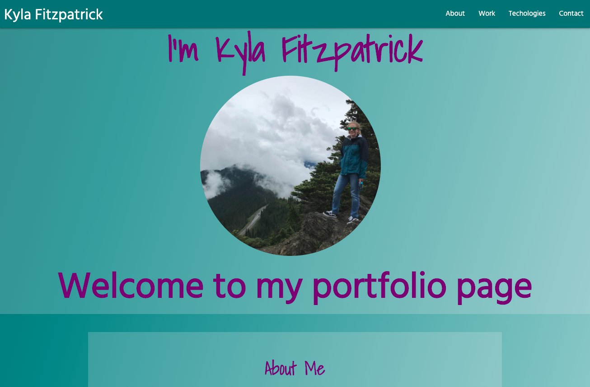

# Portfolio

 
### What the project does: 
This is an updated portfolio about my experience, projects I worked on as well as ways to contact me.

### Why the project is useful: 
This project is to showcase my the skills I have learned in lately and bootcamp thus far as well as ways to contact me and my experience so far as a web developer.

### Where users can get help with your project: 
Users can get help with this project by using stack overflow for any questions they might have. I used bootstrap, css, fontawesome and html to create this portfolio page.

### Who maintains and contributes to the project: 
Kyla Fitzpatrick maintains and contributes to this project.

### Deployed link: 
https://kylafitzpatrick.github.io/KylaFitzpatrick/
